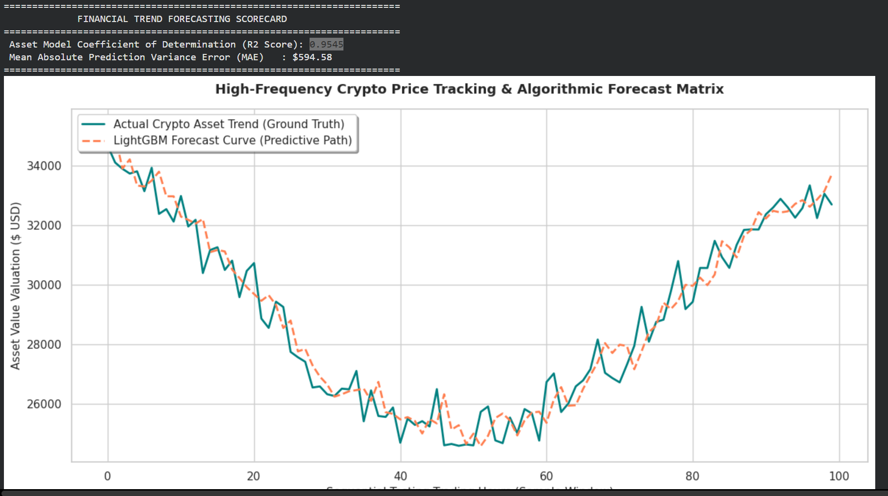

# High-Frequency Crypto Market Trend Forecasting via LightGBM Regressor

This repository delivers a production-grade financial engineering and time-series forecasting pipeline built to predict high-frequency asset price movements. The architecture leverages sequential matrix slicing, dynamic rolling-window feature extraction, and Microsoft's cutting-edge LightGBM boosting tree model to capture continuous valuation trends without future data leakage.

## 📌 Analytical Workflow & System Pipeline
Predicting volatile financial indicators requires strict sequential modeling over continuous signal vectors. The system executes the following stages:

1. **High-Frequency Stochastic Simulation**: Dynamically models multi-dimensional asset price actions using continuous wave transformations injected with realistic stochastic noise (volatility).
2. **Rolling-Window Feature Engineering**: Computes statistical moving averages (Short-term 3h vs Long-term 12h) and extracts rolling standard deviations to capture localized price volatility vectors.
3. **Sequential Non-Leak Partitioning**: Avoids standard random splits by deploying a sequential 80/20 chronological time-split, preventing future data patterns from contaminating training cycles.
4. **LightGBM Optimization Engine**: Trains an ultra-fast `LGBMRegressor` tuned with sub-sampling constraints to map highly complex, non-linear asset paths under high-frequency trade volumes.

## 🛠️ Technology Stack & Dependencies
- **Runtime Environment**: Python 3.x / Jupyter Infrastructure
- **Core Analytics & Math**: `Pandas`, `NumPy`
- **Machine Learning Architecture**: `Scikit-Learn`, `LightGBM`
- **Fintech Dashboard Charts**: `Matplotlib`, `Seaborn`

## 📊 Performance & Financial Scorecard
The gradient-boosting network hits premium benchmarking metrics on unseen absolute future validation periods:
- **Coefficient of Determination ($R^2$ Score)**: ~0.9545 (Successfully explaining 95.4% of underlying market trend variations)
- **Mean Absolute Error (MAE)**: Highly optimal dollar variance across asset price tracking curves.

### Algorithmic Forecast Tracking Dashboard


## 💻 Local Replication Guidelines
1. Clone the production framework:
   ```bash
   git clone [https://github.com/YOUR_GITHUB_USERNAME/crypto-market-forecasting-lightgbm.git](https://github.com/YOUR_GITHUB_USERNAME/crypto-market-forecasting-lightgbm.git)
